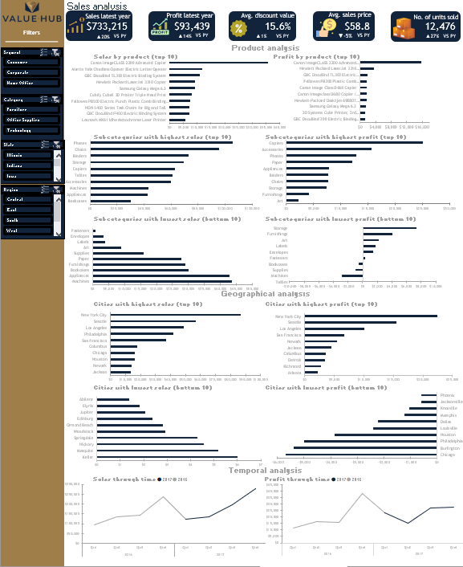
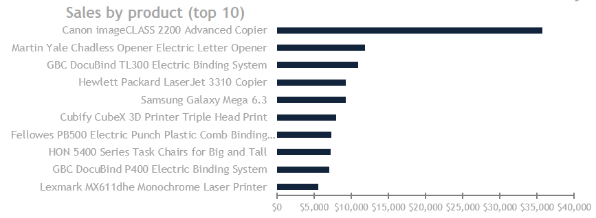
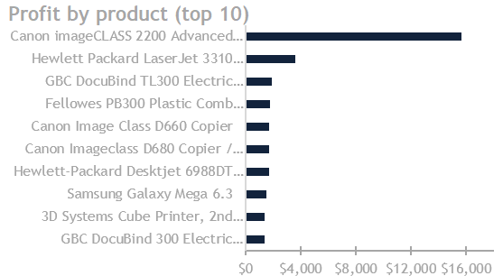
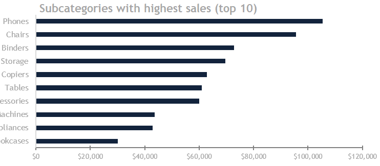
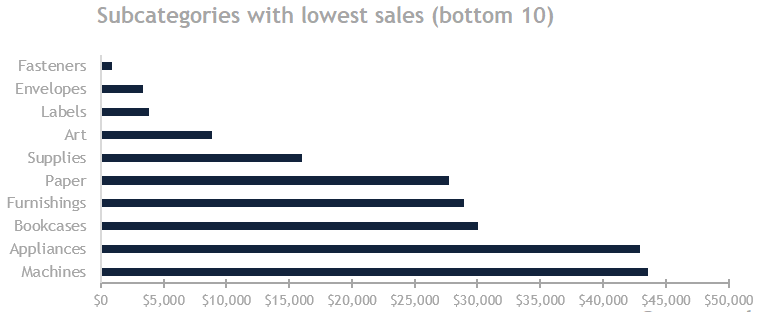
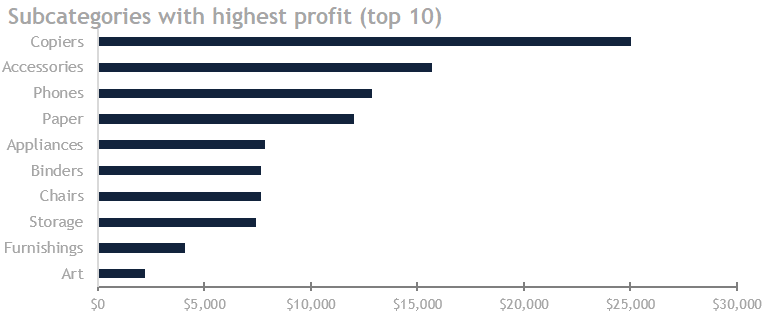
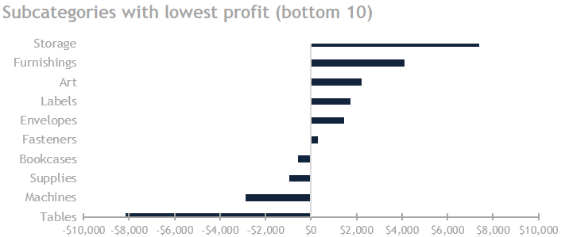

# Sales analysis for ValueHub company

## Project Background

ValueHub, since 2014 offers a variety of products to cover all shopping needs in a central location (superstores), while providing
low prices. The company is recognized for its commitment to operational excellence and customer satisfaction.

The organization has a huge quantity of detailed sales data. This project goes deep into that information to inform how the latest year (2017) performed against the previous one (2016).

The insights and recommendations are given in the following key areas:

- Product analysis: Analyze product-related data to extract key performance indicators (KPIs), including the top product by sales (general, segment, and category) and the top product by profit (general, segment, and category).

- Geographical analysis: Analyze location-related data to provide financial metrics at the same level.

- Temporal analysis: Analyze temporal-related data to provide financial metrics at the same level.

## Data Structure and initial checks

The provided dataset has 5,889 observations, each representing a transaction, including temporal, customer, geographical, categorical, subcategorical, and financial data. It contains 21 columns with information on ValueHub's sales data, including:

| Column | Purpose |
| --- | --- |
| Row ID | Unique identifier for each row in the dataset, used for referencing and indexing purposes |
| Order ID | Unique identifier for each order, used to group related rows together |
| Order Date | Date when the order was placed, used to track order timeline and analyze sales trends |
| Ship Date | Date when the order was shipped, used to track order fulfillment and shipping times |
| Ship Mode | Method of shipping used for the order (e.g. ground, air, freight), used to analyze shipping costs and efficiency |
| Customer ID | Unique identifier for each customer, used to track customer behavior and loyalty |
| Customer Name | Name of the customer, used to personalize marketing and customer service efforts |
| Segment | Category or group that the customer belongs to (e.g. retail, corporate, government), used to analyze sales trends and target marketing efforts |
| Country | Country where the customer is located, used to analyze international sales and market trends |
| City | City where the customer is located, used to analyze regional sales and market trends |
| State | State or province where the customer is located, used to analyze regional sales and market trends |
| Postal Code | Postal code of the customer's location, used to analyze local sales and market trends |
| Region | Broader geographic region where the customer is located (e.g. North America, Europe), used to analyze sales trends and market expansion opportunities |
| Product ID | Unique identifier for each product, used to track product sales and inventory |
| Category | High-level category of the product (e.g. electronics, furniture, clothing), used to analyze sales trends and product performance |
| Sub-category | More specific category of the product within the high-level category (e.g. laptops, desks, shirts), used to analyze sales trends and product performance |
| Product Name | Name of the product, used to identify and track specific product sales |
| Sales | Total revenue generated by the sale of the product, used to analyze sales performance and revenue growth |
| Quantity | Number of units of the product sold, used to analyze sales volume and inventory management |
| Discount | Amount of discount applied to the sale, used to analyze pricing strategies and revenue impact |
| Profit | Net profit generated by the sale of the product, used to analyze profitability and product performance |

## Executive Summary

### Overview of findings

ValueHub showed positive financial performance in the most recent year compared to the previous year. Sales reached $733,215, 
reflecting a 20% increase from the prior year's sales of $609,206. Profit also demonstrated a similar upward trend, amounting to 
$93,439, a 14% rise from last year's profit of $81,795. The average discount value remained relatively consistent between the 
two years. However, the average sales price decreased by 5%, now at $58.80. Additionally, the number of units sold increased by 27%, 
totaling 12,476 units compared to 9,837 units the previous year. The following sections will provide a detailed exploration of 
these results. The interactive dashboard in Excel can be found [here](https://1drv.ms/x/c/ab7f92ee74de1e95/ERezKRgKKFtOv0dAu8hS0CUBtDejzFhtVSTf0Esc0xtCjA?e=IqxD28).

### Product analysis

#### Sales by product (top 10)

The most sold products in the latest year are related to high-end copying and printing solutions, dominating the top sales positions.

#### Profit by product (top 10)

The products that generate the most profit are the same as sales. 

### Subcategories with highest sales (top 10)

The subcategories that sold the most in the latest year can be divided into technology items 
like phones (top product line), followed by furniture and organizational needs; the rest are 
related to supplementary and protective products.

### Subcategories with lowest sales (bottom 10)

The subcategories that sold the least in the latest year are fasteners, with $857.5, and the sales incrementally up to appliances and machines, which are closer to $45,000.

### Subcategories with highest profit (top 10)

The pattern is similar to the one with the highest sales; the difference is that the top ones are copiers, followed by accessories, phones, and the rest are office supplies.

### Subcategories with lowest profit (bottom 10)

The subcategories that generate the least profit are tables, with significant losses of $8140.69, followed by machines ($2869.21), 
supplies ($955.31), and bookcases ($583.62); the rest show minimal but positive profits between $304 and $7402.80.

### Geographical analysis

#### Cities with highest sales (top 10)

The city with the largest sales was New York City, which is expected given its large population and economic 
significance. Seattle, Los Angeles, Philadelphia, and San Francisco follow, all major cities with robust 
economic activities. It's important to notice that they collected 34% of sales in the latest year. Columbus, 
Chicago, Houston, Newark, and Jackson complete the top 10, with Jackson's inclusion potentially 
indicating specific local factors driving its sales performance.

[cities with highest sales](./cities-with-highest-sales.PNG)

#### Cities with lowest sales (bottom 10)

The cities with the lowest sales were Abilene, Elyria, Jupiter, Edinburgh, and others that complete the list representing less than 1% of the sales in the latest year.

[cities with lowest sales](./cities-with-lowest-sales.PNG)

#### Cities with highest profit (top 10)

The same pattern is almost repeated compared to the sales; New York City leads again, producing the highest profit ($22406.02), and the same three cities that complete the top four.

[cities-with-highest-profit](./cities-with-highest-profit.PNG)

#### Cities with lowest profit (bottom 10)

The cities with the lowest sales were Phoenix, Jacksonville, Knoxville, and others that complete the list.

[cities with lowest profit](./cities-with-lowest-profit.PNG)

#### Temporal analysis

#### Sales through time

The sales in 2017 are uniformly higher than in 2016, indicating overall business growth (20%). This repeats in each quarter 
in 2017 and shows higher sales than the corresponding quarter in 2016, with an average increase of $30,997.412.

[sales through time](./sales-through-time.PNG)

#### Profit through time

The profits in 2017 are uniformly higher than in 2016, indicating overall business growth (14%). This repeats in each quarter 
in the latest year, showing higher profit than the corresponding quarter in 2016, with an average increase of $8,808.04, except in Q4.

[profit through time](./profit-through-time.PNG)

### Recomendations

In the light of the previous data, her are my suppositions are recommended for reference:

1. **Enhance Product Portfolio Management**: Even while we still dominate in sales/profit of high-end copying/printing solutions and phones, 
from time to time an examination needs to be made to ascertain emerging trends and falling products.

2. **Geographic Market Optimization**: Growth expenditure and resources should be placed on high-performing cities (such as NYC, Seattle) while maintaining a cost-effective presence in lower-performing areas.

3. **Profitability improvement initiatives**: Major net loss categories, such as Tables and Machine Tools, would require more detailed analysis to uncover the real problems. This might include pricing fluctuations, market demand trends on a general level, or specific operational inefficiencies.

4. **Profit-based inventory management**: Design inventory management methods so that the margin is placed above its volume.
